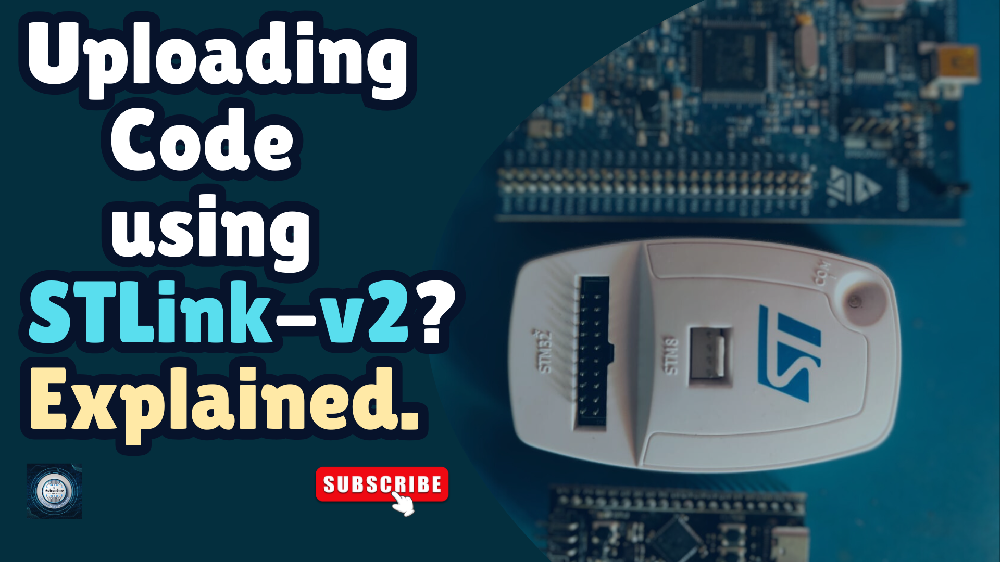

<h1 align="center">
  <a href="https://www.youtube.com/@eccentric_engineer">
	
  </a>  
</h1>

<h3 align="center">
	STM32 + Neo-6M GPS + TFT Display | Satellite Data Viewer
</h3>


  
## 📝 Overview

This project demonstrates how to interface an STM32L4 microcontroller with a u-blox Neo-6M GPS module and display 
live satellite and GPS information on the TFT screen (from the ST25 discovery kit).

u-blox Neo-6M GPS module is connected via UART. GGA and GSV sentence messages are decoded and information like
Sat Count, Location Latitude/Longitude and Satellite details (ID, SNR, etc.) displayed on TFT screen.

Based on HAL libraries / CubeIDE.

Reference taken for GPS - https://controllerstech.com/gps-neo-6m-with-stm32/  
Platform used for firmware development is STM32CubeIDE v1.15.0  
Learn more 👇👇  
  
Part 2 👇  
[](https://youtu.be/MgGj3z30gcE)  

Part 1 👇  
[](https://youtu.be/T6-8KtngSq4)  

  
## ✔️ Requirements

### 📦 Hardware
- STM32L4 MCU + TFT Display (ST25 Devkit board)
- UBloX Neo-6M GPS module
- Jumper Cables 

### 📂 Software
- STM32CubeIDE (https://www.st.com/en/development-tools/stm32cubeide.html)
- UCenter Application (https://www.u-blox.com/en/product/u-center)  

## 🛠️ Installation and usage

```sh
git clone https://github.com/AvinasheeTech/stm32-neo6m-gps-tft-display.git
Open STM32CubeIDE.
Go to option 'Open Projects from File System' and select project directory.
Go to Core/Src/main.c and press Ctrl+B shortcut to build it or use build icon from toolbar.
Next connect your board. Setup Debug Configurations. 
Select Run or Debug icon and make sure that elf file is selected in respective configurations.
Once upload is complete, connect Neo-6m gps module to the uart pins highlighted in .ioc file.
Enjoy...🍹
```
To learn more about how to upload code to STM32 controllers using STLink-V2, click link below 👇👇  

[](https://youtu.be/XuZgJvGf_Nw)


## ⭐️ Show Your Support

If you find this helpful or interesting, please consider giving us a star on GitHub. Your support helps promote the project and lets others know that it's worth checking out. 

Thank you for your support! 🌟

[](https://github.com/AvinasheeTech/stm32-neo6m-gps-tft-display/stargazers)
